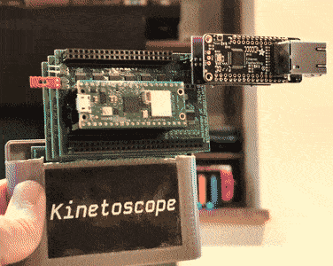

<h1>
  <picture>
    <source media="(prefers-color-scheme: dark)" srcset="logo-dark.svg">
    <source media="(prefers-color-scheme: light)" srcset="logo.svg">
    
  </picture>
</h1>

A Sega Genesis / Mega Drive Streaming Video Player

## Overview

Kinetoscope can either play video embedded in a standard ROM, or it can stream
video over WiFi using special hardware in a custom cartridge.  It uses a custom
video format detailed in
[`software/player/inc/segavideo_format.h`](software/player/inc/segavideo_format.h)
and encoded by
[`encoder/encode_sega_video.py`](encoder/encode_sega_video.py).

Kinetoscope takes its name from the [first moving picture
device](https://www.britannica.com/technology/Kinetoscope), invented in 1891 by
Thomas Edison and William Dickson.  While the 1891 original Kinetoscope was
able to display 46 frames per second, this project for a 1988 game console can
only push 10.

The default format is displayed at ~320x240p analog SD resolution at 10fps,
with 8-bit PCM audio at 13kHz.  The encoded pixels are not square.  The encoded
frames use a 256x224 resolution due to hardware limitations, and are displayed
at a different ratio by the Sega's Video Display Processor (VDP).

If video is embedded in the ROM, you can only fit about 13.6 seconds in a 4MB
cartridge/ROM.

For streaming, an RLE compression scheme is used to reduce required throughput,
and the microcontroller decompresses the video into SRAM on the fly.

Schematics and board layouts for special streaming hardware can be found in the
[`hardware/`](hardware/) folder.

You can download a pre-built emulator for macOS, Windows, or Linux from the
[releases page](https://github.com/joeyparrish/kinetoscope/releases).
(**NOTE:** On Linux, you should have OpenGL and PulseAudio pre-installed to use
these binaries.)

## Web Demo

To see Kinetoscope in a web-based emulator, check out
[https://joeyparrish.github.io/kinetoscope/](https://joeyparrish.github.io/kinetoscope/)

## Prototype

The first working prototype of the hardware was a stack of boards that looked
like this:

## Presentation

 - [Video presentation](https://youtu.be/0Atlf_whVgA)
 - [Presentation slides](https://docs.google.com/presentation/d/1nqJEwOmjEmVEMR6anbMV5HIaqYFpPi18ib-LaNSrTQE/)

## Project Folders

Each folder has a README with more information, including prerequisites that
must be installed to work on that part of the project.

 - [`software/`](software/): The player library and sample projects, which run
   on the Sega, written using [SGDK][].
 - [`encoder/`](encoder/): The video encoder, which generates videos in an
   appropriate format for embedding or streaming.
 - [`hardware/`](hardware/): The schematics and board layouts for a custom
   cartridge with special streaming hardware.
 - [`firmware/`](firmware/): The firmware that runs on the microcontroller of
   the custom cartridge hardware.
 - [`emulator-patches/`](emulator-patches/): Patches for OSS emulators to
   emulate the streaming hardware.
 - [`server/`](server/): Details on running a server for Sega video streams.
 - [`canned-videos/`](canned-videos/): Download canned, pre-encoded videos.

## Links

 - [SGDK][]: A free and open development kit for the Sega Genesis / Mega Drive
 - The logo font is [Kode Mono](https://kodemono.com/)
 - [Sega Genesis Slide Generator and Viewer](https://github.com/joeyparrish/sega-slides/)
 - [Krikzz](https://krikzz.com/our-products/cartridges/): Incredible hardware
   for retro game console hacking and development, including flash carts.

[SGDK]: https://github.com/Stephane-D/SGDK
