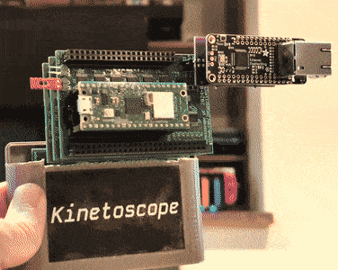

# Kinetoscope Hardware Design

The hardware is composed of several stacking boards, each of which hosts a set
of subcomponents.  The subcomponents are each in a subsheet, exposing
hierarchical pins and buses to the parent sheet.

One of these boards includes a microcontroller with WiFi, and runs its own
firmware to take commands from the Sega ROM.  See firmware in the
`../firmware/` folder.


## Prototype

The first working prototype looked like this:




## Prerequisites

The hardware design was done in KiCad 9, and routing was done in FreeRouting.
To install KiCad 9 and FreeRouting on Ubuntu, run:

```sh
sudo add-apt-repository --yes ppa:kicad/kicad-9.0-releases
sudo apt update
sudo apt install --install-recommends kicad default-jre wget unzip
wget https://github.com/freerouting/freerouting/releases/download/v1.9.0/freerouting-1.9.0-linux-x64.zip
sudo unzip -j -d /opt/freerouting freerouting-1.9.0-linux-x64.zip freerouting-1.9.0-linux-x64/lib/app/freerouting-executable.jar
```

To install the custom footprints and symbols used in this design, on Ubuntu
run:

```sh
mkdir -p ~/.local/share/kicad/8.0
cp -a hardware/libraries/* ~/.local/share/kicad/8.0/
```

If you have pre-existing KiCad configs, add these new symbol and footprint
libraries to your config via "Preferences" > "Manage Symbol Libraries" and
"Preferences" > "Manage Footprint Libraries".

If you don't have pre-existing KiCad configs, you can copy the tables used in
the automated workflows:

```sh
mkdir -p ~/.config/kicad/8.0
cp .github/workflows/*-lib-table ~/.config/kicad/8.0/
```

To see hardware schematics without KiCad, open the PDF files in the
[`hardware/`](hardware/) folder.

To order boards, see hardware zip files attached to
[releases](https://github.com/joeyparrish/kinetoscope/releases).  These can be
uploaded to JLCPCB.

TODO: Document ordering process


## Boards

The stacking boards are:
 - `cart`: Cartridge Board
   - This is the board that actually plugs into the Sega Genesis.
   - It has 2MB of flash, which acts as the "ROM" chip for addresses 0-2MB, and
     contains the code that runs on the Sega.
   - The flash chip is compatible with the [Krikzz FlashKit Programmer MD][].
   - There is also a pin header on top that the other boards stack onto.
   - The pin header could also be used as a kind of breakout board for the
     development of other Sega cartridge projects.
   - Right-angle pin headers on the sides of the board are optional, and used
     only for debugging.
   - When ordering this through JLCPCB:
     - Be sure to set the following options:
       - Surface Finish: ENIG
       - Gold Fingers: Yes
       - 30°finger chamfered: Yes
     - The following parts will not be properly placed by JLCPCB's systems
       automatically, and must be adjusted manually during the ordering process:
       - J1 (pin header for attaching other boards, wrong location and rotation)
       - U2 (voltage regulator, offset a little too far to the right)
     - The following optional parts _may_ be populated by hand if you wish:
       - J4 (2-pin right-angle header for measuring current)
 - `sram-bank`: SRAM Bank Board
   - There are actually two of these in the stack, one for each 1MB SRAM bank.
   - These host the SRAM itself, and the buffers that allow it to be
     alternately controlled by the Sega or the microcontroller.  This is the
     most complex.  Two solder jumpers on the board select whether it responds
     as bank 0 or bank 1.
   - When ordering this through JLCPCB:
     - The following parts could easily be populated by hand if you wish:
       - J1 & J2 (stacking headers, 2x26 and 2x21 pins respectively)
     - The following **must** be soldered by hand:
       - JP1 and JP2 are solder jumpers that must be closed on each board; to
         set bank 0, bridge center to left on both jumpers; to set bank 1,
         bridge center to right on both jumpers (also indicated on silkscreen)
 - `microcontroller`: Microcontroller Board
   - This hosts the microcontroller, registers, sync token, and buffers to send
     data to SRAM.
   - The registers and sync token allow the Sega to send commands to the
     microcontroller and wait for responses.
   - The microcontroller is a Raspberry Pi Pico W, which receives commands
     through the registers and sync token, and is responsible for WiFi/Ethernet
     and streaming video to SRAM.  You can buy one here for $7 (as of September
     2024): https://www.adafruit.com/product/5544
   - When ordering this through JLCPCB:
     - The following parts may not be properly rendered by JLCPCB's systems
       automatically.  You may choose to leave them off your order and populate
       them by hand if you wish:
       - J3 and J4 are 20-pin female headers @ 0.1 inch pitch, to mount a
         Raspberry Pi Pico W with male headers facing down
     - The following parts could easily be populated by hand if you wish:
       - J1 & J2 (stacking headers, 2x26 and 2x21 pins respectively)
       - J6 (optional 2x3 female header to connect to an Ethernet Adapter Board
         with an [Adafruit Ethernet Featherwing][])
     - The following **must** be done by hand:
       - A single jumper must be added to either J5 or J7 (see silkscreen notes
         for play vs programming setting)
 - `ethernet`: Ethernet Adapter Board
   - This connects to an optional header on the microcontroller board and
     allows you to plug in the [Adafruit Ethernet Featherwing][].
   - If Ethernet is connected, the firmware prefers Ethernet over WiFi.
   - When ordering this through JLCPCB:
     - All headers could easily be populated by hand if you wish to skip paid
       assembly:
       - J1 & J2 (female headers on top of the board, 1x16 and 1x12
         respectively, where the Featherwing plugs in)
     - The following **must** be done by hand, because JLCPCB will only
       populate one side of the board:
       - J3 (male header on the bottom of the board, where it attaches to the
         Microcontroller Board)


## Sheets

The subsheets are:
 - `address-counter-internal`: SRAM address counter
   - The microcontroller doesn't have enough pins to output the SRAM address it
     wants to write to, so instead, this counter is used to generate sequential
     addresses.
 - `buffer-16-internal`: 16-bit tri-state, level-shifting buffer
   - This buffer allows us to manage control of the 16-bit data bus on the
     SRAM, switching between Sega and microcontroller control when needed.
 - `buffer-22-internal`: 22-bit tri-state, level-shifting buffer
   - This buffer allows us to manage control of the 19-bit address bus and
     control signals on the SRAM, switching between Sega and microcontroller
     control when needed.
 - `data-register-internal`: 16-bit serial-to-parallel shift register
   - The microcontroller doesn't have enough pins to output the SRAM words it
     wants to write, so instead, this register is used to convert a serial
     output from the microcontroller into the parallel input needed by the
     SRAM.
 - `flash-internal`: Flash connected to buses
   - Flash memory connected to buses to simplify top-level schematics.
 - `kinetoscope-header-internal`: Kinetoscope stacking pin headers
   - The stacking pin headers used for inter-board signals.
 - `register-file-internal`: 4x 8-bit Register File
   - Special registers the Sega writes to and the microcontroller reads from to
     receive commands.
 - `sram-internal`: SRAM connected to buses
   - SRAM connected to buses to simplify top-level schematics.
 - `sync-token-internal`: Shared Sync Token
   - A pair of single bit tokens.  One can be set by the Sega and cleared by
     the microcontroller, and the other vice-versa.  Both CPUs can read the
     state of both tokens.  For the command bit, the Sega sets it to tell the
     microcontroller that a command has been written to the registers. The
     microcontroller clears it when the command has been completed.  For the
     error bit, the microcontroller sets it to tell the Sega that an error has
     occurred, and the Sega clears it after the error has been read.


## Routing

To reroute a PCB after modifying the schematic:

  1. Open the PCB in KiCad
  2. Select all (CTRL+A)
  3. Right click the board, "Select >", "Filter Selected Items..."
  4. Uncheck "All items"
  5. Check "Include tracks" and "Include vias"
  6. Delete (Delete key)
  7. Update PCB from schematic (F8)
  8. Click "Update PCB", then "Close"
  9. Save PCB (CTRL+S)
  10. Select "File", "Export >", "Specctra DSN..."
  11. Click "Save" (and "Replace" if prompted)
  12. Run `route-pcb.sh` with the name of the board.  For example:

```sh
./route-pcb.sh sram-bank
```

After the routing process completes:

  1. Open the PCB in KiCad
  2. Select "File", "Import >", "Specctra Session..."
  3. Select the .ses file corresponding to this design
  4. Click "Open"
  5. Redo fill zones (B)
  6. Select "Inspect", "Design Rules Checker"
  7. Click "Run DRC"
  8. Manually fix any violations or unconnected items


## Programming

To program the Flash chip in-place:
 1. Insert the cartridge board into the [Krikzz FlashKit Programmer MD][]
 2. Write to it as you would a normal flash cart, using the
    [original FlashKit-MD software][] (GUI) or [FlashKit MD Python Client][]
    (command line)

[Krikzz FlashKit Programmer MD]: https://krikzz.com/our-products/accessories/flashkitmd.html
[original FlashKit-MD software]: https://krikzz.com/pub/support/flashkit-md/
[FlashKit MD Python Client]: https://github.com/joeyparrish/flashkit-md-py
[Adafruit Ethernet Featherwing]: https://www.adafruit.com/product/3201
